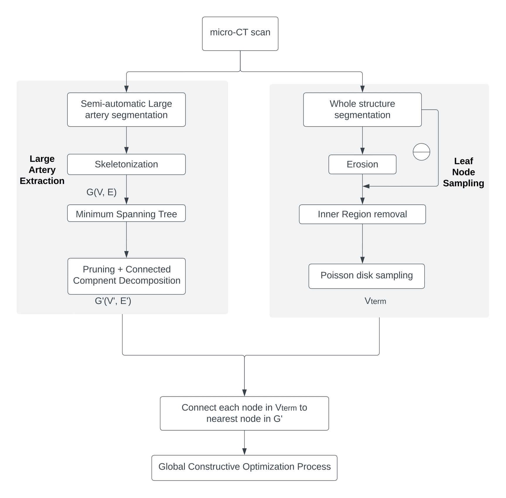

# A Hybrid Approach to Full-Scale Reconstruction of Renal Arterial Network

Here we provide the code files used for our paper and instructions. 

In general, it is not possible to finish the work by running a single script. 
Please follow flow chart and instruction below for the workflow and refer to the paper for more details. 
In particular, you may skip several steps if you already have intermediate results 
(e.g., a segmented cortex from other methods would skip the erosion and inner region removal steps). 

The final two input files for GCO extracted from image priors are the prebuilt tree ```G'(V', E')``` and the 
sampled leaf nodes ```L```. They are both in ```.vtk``` format and 
included under [optimization](./VesselGen/optimization) folder\
prebuilt tree ```G'(V', E')```: [final_main_artery.vtk](./VesselGen/optimization/final_main_artery.vtk) and
sampled leaf nodes ```L```: [sampled_terminal_nodes.vtk](./VesselGen/optimization/sampled_terminal_nodes.vtk)


   

# Installation

Run the following command for installation of the project

```
# From GitHub
git clone https://github.com/diku-dk/RenalArterialRecon

pip install -e RenalArterialRecon 

cd RenalArterialRecon
```
It will automatically build the path and install the required packages listed in requirements.txt.

Specifically, for the GCO process, only ```networkx```, ```numpy```, ```scipy```, and
```pyvista``` are needed.

Others are only used for extracting image priors, 
e.g., we need ```nibabel``` to load 3D nifty images and ```scikit-image``` for several image processing methods.

# Image prior

In general, our proposed hybrid way of utilizing image-based priors involves two segmentation maps from the kidney scans,
namely, segmentation of large arteries, and segmentation of the whole kidney structure. 
* Segmentation method is beyond the scope of this work. 
Briefly, you can use any state-of-the-art method e.g., Convolutional Neural Networks, to do vessel segmentation.
whole kidney structure is usually enough by a simple thresholding with potential morphological smoothings.
But in the end, make sure the two segmentation maps are simply binary images in nifty ```.nii.gz``` format

<b> <ins> If you have already extracted main vessels and sampled terminal nodes in your case, 
you can directly go to GCO Optimization step for the vascular tree reconstruction. </ins> </b>


[preprocessing](./VesselGen/preprocessing)     includes the code files needed for converting the raw segmentation maps 
(in .nii.gz) into the form we need.
Specifically, below we demonstrate the two operations

### Sampling terminal nodes
The segmentation of the whole kidney structure Yw is used to extract an estimated cortex and sample terminal nodes
(the distal end of afferent arterioles where glomerulus grow from) inside the cortex. The code files are given under the subfolder ```preprocessing```
* To get an estimated cortex, run 
```
python preprocessing/cortex_extraction.py
```
It takes the original whole kidney structure ```.nii.gz``` file 
and output an estimated cortex segmentation map, also in nifty ```.nii.gz``` format

* Then, to sample terminal nodes in the cortex, run 
```
python preprocessing/sample.py
```
It takes an estimated cortex segmentation map, and output sampled points in ```.vtk``` file.

### Prebuilding main arterial tree 

The segmentation of large arteries is used to prebuilt a main arterial tree consisting of the first few large vessels. 
The code files are given under the subfolder ```preprocessing```

* To do this, you will first need to extract a surface mesh and doing skeletonization. 
You can run 
```
python preprocessing/marching_cubes.py
``` 
to extract surface mesh, which will give a ```.obj``` file
* Then, to do centerline extraction and get a graph structure, run 

```
python preprocessing/pygel_graph_gen.py
```

It takes input as previous ```.obj``` file and the original ```.nii.gz``` file, 
and output the centerline graph in ```.vtk``` file

* Then, to remove all the artifacts and only preserving main arteries in a tree structure from the extracted centerline,
several preprocess operations need to be performed, e.g. minimum spanning tree, edge collapsing, pruning,
Run 
```
python preprocessing/read_to_network.py
```
 It takes the centerline graph in ```.vtk``` file as input and ouput the preprocessed tree in ```.vtk``` file 
. The pruning involve several hyper-parameters and 
might need to tuned for individual cases,
depending on how noisy the input is, and how large portion a main tree should be preserved


# Final GCO Optimization


Subfolder [optimization](./VesselGen/optimization) includes the main code files for the final Global Constructive Optimization method. 
Specifically, to reproduce the result, run 
```
python optimization/GCOForestDi.py
``` 
To make use of the extracted image priors, you will need to provide ```GCOForestDi.py```  a prebuilt tree, 
as well as the sampled leaf nodes in the estimated cortex, both given in ```.vtk``` format. 
Both will be read into ```numpy arrays``` by ```pyvista```.
Finally, you need to specify a single 1D array of length 3 representing the ```root``` position.

The hyper-parameters we used are given in the code already, 
but you may also want to adjust them when applying to other organs or subject scans

* Weigthting factor for material cost and power cost
* Merging threhold
* Pruning threshold
* Number of iterations
* Physics properties and boundary conditions
  * viscosity (mu)
  * inlet flow
  * voxel size (this is essential to make sure that the length computation is correct)
  * terminal radius (either a single number or two numbers representing mean and std)

This will output the final reconstructed tree in ```.vtk``` structure

## Result ananlysis and validation

[result_analysis](./VesselGen/result_analysis) includes the code files for the validation as well as visualization. 
To reproduce the morphological statistics in comparison to the experimental data given by [Nordsletten et al.](https://journals.physiology.org/doi/full/10.1152/ajpheart.00814.2005) as shown in paper, run 
```
python result_analysis/MorphAnalyzer.py
``` 
by giving it the input of the generated tree.

Hemodynamic feature following Poiseulle's law can be generated by runing
```
python result_analysis/simulate_flow_pressure.py
``` 
with an inlet pressure (given in 100mmHg by default)

## Visualizations of Results

##  1. Gif results in 3D
Here we show some animations of our generated renal arterial tree in ParaView. (Please give the page few seconds to load if the gifs are not shown to you immediately). More visualizations are available at https://github.com/KidneyAnonymous/RenalArterialTree
Different gifs represent the tubes are colored by different properties, e.g., radius, flow, pressure.
These gifs are stoed in ```visualizations``` folder.

### Colored by radius (in $\mu m$)
  
### Colored by flow (in $\mu m^3/s$)
  
### Colored by pressure (in mmHg)
  
